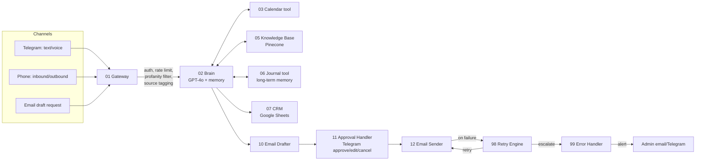

# How YTUMA AI Works — End to End

A plain-English walkthrough of the system in `../n8n-workflows/`, suitable for explaining to a prospect or
new client who doesn't care about node names.

## The one-sentence version

One central AI ("the Brain") answers requests from Telegram, phone calls, or email; a front gate keeps bad
input out; a set of tools let it actually check your calendar, remember facts, and look things up; and a
safety net catches, retries, and reports failures instead of letting things fail silently.

## The flow, step by step

## What each piece is doing, in human terms

**1. The Gateway (01)** is the bouncer. Every request — whether it came from a text message, a phone call,
or an internal trigger — passes through here first. It checks that the request isn't spam, strips out any
malicious content, and tags where it came from. Nothing reaches the AI without going through this door.

**2. The Brain (02)** is the actual decision-maker. It reads a profile of the business (preferences, past
patterns, recent history), builds a full context for the AI model, and decides what to do: answer directly,
look something up, check a calendar, or save a new fact for later. It remembers the last several messages
in a conversation so follow-up questions make sense.

**3. The tools (03, 05, 06)** are what keep the Brain honest. It doesn't *guess* whether a time slot is
free — it asks the calendar tool. It doesn't *pretend* to know company pricing — it searches the actual
knowledge base of ingested documents. When it learns something worth remembering long-term, it writes it
down through the journal tool rather than forgetting it the moment the conversation ends.

**4. The channels (04, 08, 09)** are how people actually talk to it. Telegram handles text and voice notes
(transcribed automatically). The phone workflows let it place outbound calls with a generated script, or
answer inbound calls, transcribe what the caller says, and respond out loud — all while logging the
interaction.

**5. The CRM (07)** is the memory of every human the business has talked to. Every interaction — a text, a
call, an email — becomes one row in an interaction history, and every contact gets one continuously-updated
record: who they are, when you last talked, what stage they're at, what's next.

**6. The email pipeline (10 → 11 → 12)** is deliberately cautious. The AI drafts an email, but it never
sends it directly — it logs the draft and pings a human on Telegram to approve, edit, or cancel it first.
Only after approval does the sender workflow actually deliver it, and even then it validates the message,
supports scheduled sending, and handles attachments safely.

**7. The safety net (98, 99)** is what separates this from a hobby automation. When something fails — an
email doesn't send, an API call times out — the retry engine decides intelligently whether to try again,
how long to wait, or whether to give up and escalate. If it escalates, the error handler logs it, checks
whether this is a one-off or a repeating problem, and only sends an alert when it's actually worth
interrupting a human for — so the system stays quiet when it's healthy and loud only when it matters.

## Why this architecture, specifically, is worth paying for

Anyone can wire a chatbot to send a canned reply. What's hard — and what this system actually does — is:
- Keep a **single source of truth** for "what does the AI know and remember" instead of scattering logic
  across a dozen disconnected automations
- Put a **human approval step** in front of anything that leaves the building (an email, a phone script)
- **Fail loudly to the right person**, not silently, and not to everyone every time
- Treat every workflow as a **swappable module** (a "tool") the Brain calls, so adding a new channel (e.g.
  WhatsApp) doesn't require rebuilding the decision logic

That's the pitch, in one paragraph, if someone asks "why not just use ChatGPT?"
